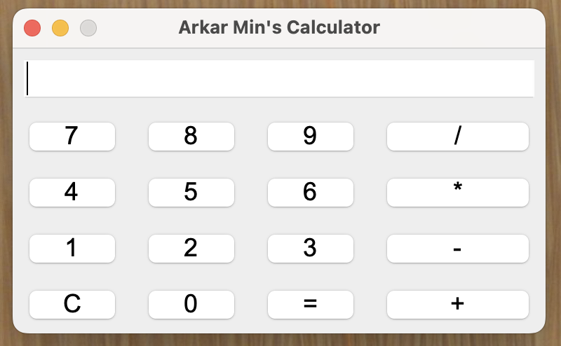

# Java Calculator

A modern and user-friendly calculator application built using Java Swing. This project demonstrates the creation of a simple yet functional calculator with a graphical user interface (GUI).

## Features

- Basic arithmetic operations: Addition, Subtraction, Multiplication, and Division
- Clear button to reset the current input
- Responsive layout with a clean and modern design
- Error handling for division by zero

## Screenshot

